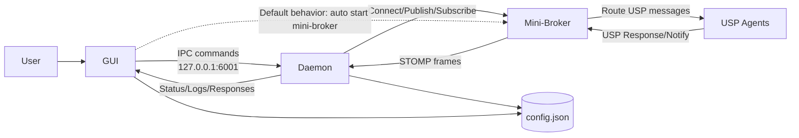

# USP Controller

TR-369 USP Controller（GUI 版本）。

## 系統架構

本專案採用「GUI 控制面 + Daemon 執行面 + Mini-Broker 訊息面」三層設計：

- **GUI**
   - 使用者唯一操作入口
   - 透過 IPC（127.0.0.1:6001）控制 Daemon
   - 顯示 Daemon 即時輸出與狀態
   - 可由 GUI 管理 Daemon 與 Mini-Broker

- **Daemon（背景模式）**
   - 負責 USP 訊息組包、發送、回應解析
   - 維護設備清單、快取、連線狀態
   - 對 GUI 提供 IPC 指令服務（status/get/set/reload...）

- **Mini-Broker（內建）**
   - 內建 STOMP 測試 broker
   - 提供本機訊息路由，不需外部 ActiveMQ/RabbitMQ
   - GUI 可查看 broker 狀態與 debug 訊息

### 架構圖（Mermaid）

### 啟動與執行流程

1. 使用者執行 `run_gui.bat`
2. GUI 透過 IPC 控制 Daemon 啟動（GUI 會清理舊 daemon，避免殘留衝突）
3. Daemon 建立與 Mini-Broker 的連線（publish/subscribe）
4. Mini-Broker 將 USP 訊息路由到 Agent
5. Agent 回應經由 Mini-Broker 回到 Daemon
6. Daemon 將結果回送 GUI 顯示

> 預設行為：GUI 啟動後會自動啟動 Mini-Broker，以縮短測試流程。

## Windows 使用方式（唯一入口）

1. 雙擊 `run_gui.bat`
2. 腳本會自動完成：
   - Python 可用性檢查
   - `requirements.txt` 依賴安裝/更新
   - 啟動 GUI

> Windows 安裝流程已封裝在 `run_gui.bat`，不需要手動 pip 安裝步驟。

## Mini Broker 支援

- GUI 內建 Mini Broker 管理（啟動/停止/狀態）。
- 開發與一般使用不需要額外安裝或配置外部 Broker（如 ActiveMQ/RabbitMQ）。
- 預設可直接用內建 Mini Broker 運作。

## 目錄分工

- `scripts/`: 僅放 USP 測試腳本內容（例如 `.txt` 測試流程）
- `tools/`: 維運與開發工具（例如版本號工具、資料收集工具）
- `docs/`: 各模組功能說明文件

## 需求

- Windows
- Python 3.8+

## 備註

- 本專案已精簡為單一使用者入口：`run_gui.bat`。
- 其餘啟動與除錯用腳本已移除。
