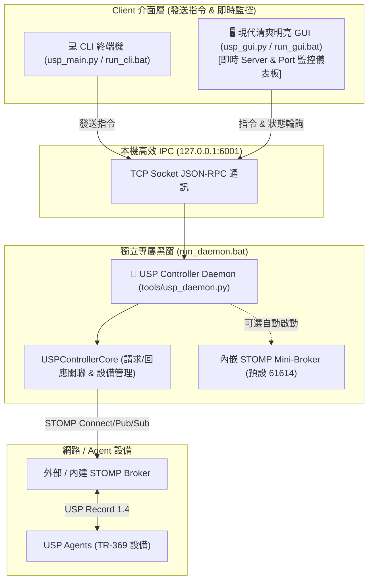

# USP Controller (TR-369)

高可靠、模組化、**以 CLI / CMD 為核心** 的 TR-369 USP Controller，兼具 **獨立黑窗守護進程 (Daemon)**、**現代清爽明亮風 GUI 控制台** 與 **CDRouter 自動化測試腳本引擎**。

---

## 🌟 系統架構與特色 (Architecture & Features)



### 1. 獨立黑窗守護進程 (Dedicated Console Daemon)
- **STOMP Broker 與 Controller Core 獨立運行於黑窗守護進程**：
  - 維持 STOMP 長連線、自動重連、監聽 USP Notify 事件、設備在線管理。
  - 開放本機高效 IPC 服務（`127.0.0.1:6001`）。
  - 一鍵啟動：`run_daemon.bat`。

### 2. 現代清爽明亮風 GUI (Modern Clean Light Theme)
- 告別過暗的黑色介面，採用 **Slate Clean Light（現代高雅商用明亮風）**。
- **頂部 Server & Port 狀態列**：即時掌握 Daemon 狀態 (PID/Uptime)、Broker 連線狀態、Broker Port (`61614`) 與 IPC Port (`6001`) 監聽狀態、Active Target 設備。
- **四大核心面板**：
  1. **🎛️ Command Deck (指令台)**：常用操作快速鍵、底端指令輸入列（支援歷史上下鍵）、高對比彩色 Log 輸出終端。
  2. **🧪 CDRouter Scripts (測試腳本運行器)**：腳本選單、一鍵測試、即時每步 Pass/Fail 燈號與統計摘要。
  3. **📡 Server & Port Monitor (實時伺服器與通訊埠監控)**：Port 監聽狀態卡片 (Broker 61614, IPC 6001, mDNS)、行程資源監控。
  4. **📱 Device Registry (設備總覽)**：即時檢視所有在線/離線 Agent 並快速切換目標。

### 3. 原生支援 CDRouter 測試腳本 (Script Runner)
- 支援 `scripts/` 下的各類 `.txt` 測試腳本（如 `test_dhcpv4_pool.txt`、`prplos.1.1.x.txt`）。
- 原生支援 `{ENDPOINT}`, `{INSTANCE}`, `{BRIDGE_INST}`, `{PORT_INST}` 與 `$VAR` 動態變量。
- 原生支援 `# expect: <value>` 斷言驗證，產出結構化 PASS/FAIL 測試報告。

---

## 🚀 快速開始 (Quick Start)

### 1. 啟動後台守護進程黑窗 (Daemon)
```bash
# Windows 一鍵啟動 (獨立黑窗)
run_daemon.bat

# 或使用 Python 啟動
python tools/usp_daemon.py
```

### 2. 啟動現代清爽 GUI
```bash
# Windows 一鍵啟動
run_gui.bat

# 或使用 Python
python usp_gui.py
```
> 若 Daemon 尚未啟動，GUI 頂部會顯示提示，點擊 **「🚀 Launch Daemon」** 即可一鍵喚起黑窗守護進程！

### 3. 啟動互動式 CLI (CMD)
```bash
# Windows 一鍵啟動
run_cli.bat

# 或使用 Python
python usp_main.py
```

### 4. 執行單次指令 (One-Shot CLI)
```bash
# 查詢設備資訊
python usp_main.py get Device.DeviceInfo.

# 修改參數值
python usp_main.py set Device.WiFi.SSID.1.SSID "MyHomeWiFi"

# 執行 CDRouter 測試腳本
python usp_main.py script scripts/test_dhcpv4_pool.txt

# 查看連線狀態與可用設備
python usp_main.py status
python usp_main.py devices
```

### 5. 運行完整單元與整合測試
```bash
# Windows 一鍵運行
run_tests.bat

# 或使用 Python
python run_tests.py
```

---

## 💻 CLI 常用指令表 (Command Reference)

| 命令 (Command) | 別名 (Aliases) | 說明 (Description) | 範例 (Example) |
| :--- | :--- | :--- | :--- |
| `help` | `h`, `?` | 顯示所有可用指令或特定指令用法 | `help get` |
| `status` | `stat`, `info`| 顯示控制器、傳輸層連線與目標設備狀態 | `status` |
| `devices` | `list`, `ls` | 列出所有已發現/註冊的 Agent 設備清單 | `devices` |
| `target` | `use`, `device` | 檢視或切換預設操作的目標設備 Endpoint | `target proto::agent-001` |
| `scan` | `discover` | 透過 mDNS 掃描區域網路內的 USP Agent | `scan` |
| `get` | - | 查詢資料模型參數值 | `get Device.DeviceInfo.` |
| `set` | - | 設定資料模型參數值 | `set Device.X.Value 123` |
| `add` | - | 新增 Multi-Instance 物件實例 | `add Device.DHCPv4.Server.Pool.` |
| `delete` | `del`, `rm` | 刪除 Multi-Instance 物件實例 | `delete Device.DHCPv4.Server.Pool.2.` |
| `operate` | `op` | 執行遠端 RPC 指令/操作 | `operate Device.IP.Diagnostics.IPPing()` |
| `get_supported_dm` | `dm` | 查詢 Agent 支援的資料模型結構 | `get_supported_dm Device.` |
| `get_instances` | `instances` | 查詢已實例化的物件路徑 | `get_instances Device.IP.Interface.` |
| `run_script` | `script`, `run` | 執行 CDRouter / USP 測試腳本 | `run_script scripts/test_dhcpv4_pool.txt` |
| `list_scripts` | `scripts` | 列出 `scripts/` 目錄下的所有測試腳本 | `list_scripts` |
| `debug` | - | 檢視或調整除錯等級 (0=Agent Only, 1=Both, 2=Full) | `debug 2` |
| `clear` | `cls` | 清理終端機畫面 | `clear` |
| `quit` | `exit`, `q` | 退出程式 | `quit` |

---

## 📁 專案結構 (Directory Layout)

```
my-usp-controller/
├── usp_main.py                 # 主要 CLI 啟動入口 (REPL / One-shot / IPC Client)
├── usp_gui.py                  # 現代清爽明亮風 GUI 儀表板
├── usp_controller.py           # 相容包裝入口
├── run_daemon.bat              # Windows 獨立黑窗守護進程一鍵啟動
├── run_cli.bat                 # Windows CLI 一鍵啟動
├── run_gui.bat                 # Windows GUI 一鍵啟動
├── run_tests.bat               # Windows 測試套件一鍵執行
├── run_tests.py                # 跨平台測試執行器 (75 個測試全數通過)
├── config.json                 # 執行期設定檔 (Broker, IPC, Mini-Broker)
├── devices.json                # 設備登錄持久化資料
├── proto/                      # Protobuf 協議定義與編譯模組
├── scripts/                    # CDRouter / USP 自動化測試腳本目錄 (.txt)
├── tools/                      # 獨立黑窗守護進程 (usp_daemon.py) 與維運工具
├── tests/                      # 單元測試與整合測試套件
└── usp_controller/             # 核心模組套件
    ├── config.py               # 型別安全設定管理
    ├── logger.py               # 執行緒安全彩色日誌
    ├── core/                   # 控制器核心 (同步請求關聯與路由)
    ├── device/                 # 設備管理器 (在線監控、目標選擇、mDNS)
    ├── ipc/                    # 本機高效 IPC 通訊 (Server / Client)
    ├── protocol/               # USP 1.4 Protobuf 編碼與結構化解析
    ├── transport/              # 傳輸層 (STOMP 1.2 / MQTT 介面)
    ├── scripting/              # CDRouter 測試腳本引擎與斷言
    └── interface/              # CLI 互動介面、格式化器與指令路由
```
